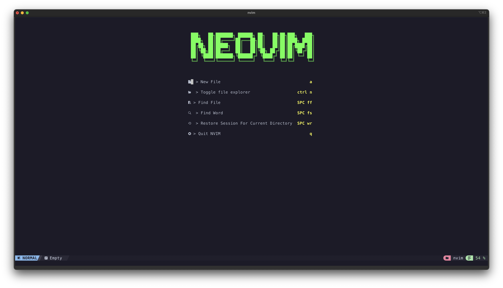

# My Neovim (NvChad)

# About
Neovim from [NvChad](https://nvchad.com)

# Plugins
## Plugins set up by NvChad
- Many beautiful themes, theme toggler by our [base46 plugin](https://github.com/NvChad/base46)
- Lightweight & performant ui plugin with [NvChad UI](https://github.com/NvChad/ui) It provides statusline modules, tabufline ( tabs + buffer manager) , beautiful cheatsheets, NvChad updater, hide & unhide terminal buffers, theme switcher and much more!
- File navigation with [nvim-tree.lua](https://github.com/kyazdani42/nvim-tree.lua)
- Beautiful and configurable icons with [nvim-web-devicons](https://github.com/kyazdani42/nvim-web-devicons)
- Git diffs and more with [gitsigns.nvim](https://github.com/lewis6991/gitsigns.nvim) 
- NeoVim Lsp configuration with [nvim-lspconfig](https://github.com/neovim/nvim-lspconfig) and [mason.nvim](https://github.com/williamboman/mason.nvim)
- Autocompletion with [nvim-cmp](https://github.com/hrsh7th/nvim-cmp)
- File searching, previewing image and text files and more with [telescope.nvim](https://github.com/nvim-telescope/telescope.nvim).
- Syntax highlighting with [nvim-treesitter](https://github.com/nvim-treesitter/nvim-treesitter)
- Autoclosing braces and html tags with [nvim-autopairs](https://github.com/windwp/nvim-autopairs)
- Indentlines with [indent-blankline.nvim](https://github.com/lukas-reineke/indent-blankline.nvim)
- Useful snippets with [friendly snippets](https://github.com/rafamadriz/friendly-snippets) + [LuaSnip](https://github.com/L3MON4D3/LuaSnip).
- Popup mappings keysheet [whichkey.nvim](https://github.com/folke/which-key.nvim)

## Plugins I have set up
- [alpha plugins](https://github.com/goolord/alpha-nvim)
